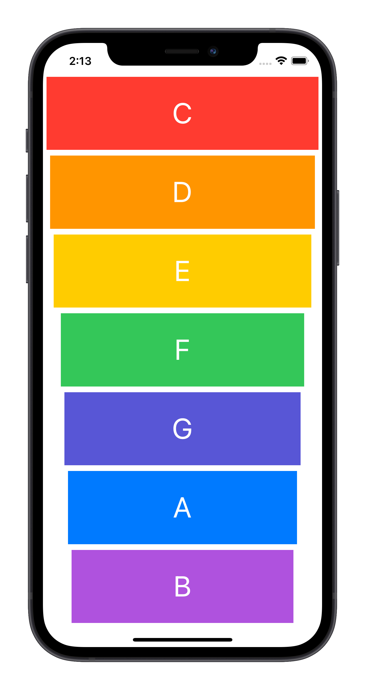

<p align="center"></p>

<h1 align="center">Xylophone</h1>

<p align="center">An application developed in Swift, it is a xilophone that plays a sound according to the key pressed.</p>

## About

This was an application designed to practice the basics of Swift.

## Screenshots



## Technologies

- [Swift](https://swift.org/)

## What I learned with this app

- How to play sound using [Apple Documentation](https://developer.apple.com/documentation);
- Learn about Swift Functions;
- Linking multiple elements to one IBAction;
- Creating functions with inputs;
- Play different sounds for different buttons;


## How to Install

```bash
# Clone this repository
$ git clone git@github.com:lucalves/xylophone-app.git

# Go into the repository
$ cd xylophone-app

# Open the repository in the IDE (If you use VS Code)
$ code .

# Just run the app on XCode!
```

